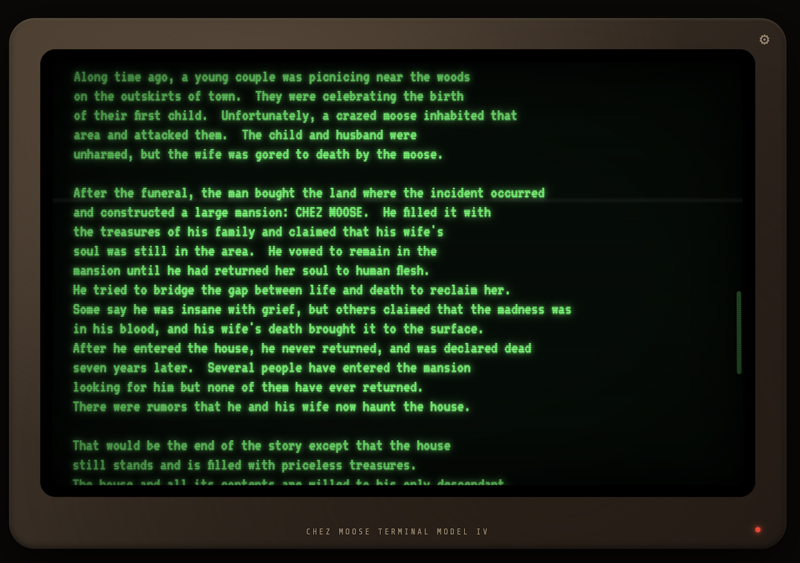

# Haunt

A web port of John Laird’s **Haunt** (1979-1983), one of the largest OPS4 programs ever written. The original is a mainframe text adventure with ~1500 production rules, 21 treasures, ~48 rooms, a madness timer, and a maximum score of 440.

This port runs entirely in the browser as a single-page app. No server, no build step, no dependencies.



## Background

I was 9 or 10 when I discovered Haunt on the PDP-10 mainframe that my dad used at the University of Texas @ Austin astronomy department. I was already obsessed with text adventure games like Zork and Colossal Cave Adventure (or ADVENT.EXE as it was called on those mainframes), but Haunt was different. It was irreverent (there’s marijuana **and** LSD!), naughty, and quirky in a way that I’d never seen in a game before, and I was hooked. I played it so much that I would regularly get “grounded from the modem” – a 300 baud VEN-TEL lollygagger. 


*Might not look like much, but she had it where it counts.*

Fast forward to a few years ago when a bout of nostalgia had me wondering if anyone had managed to port Haunt to an app or a website. I located the “original” [OPS5 source code](http://www.ifarchive.org/if-archive/games/source/haunt.ops5) for the game but just couldn’t figure how to get it ported to something modern and eventually gave up.

I hadn’t given it much thought since then, but with the advent of agentic coding, I figured maybe it was worth another shot.

## Implementation

The first pass went quickly and my probes into the game seemed faithful to the original based on memory. However after another night of gameplay I realized that significant parts of the game were missing.

As it turned out, the OPS5 “original” source code was in fact an *in progress* port of the full OPS4 source code that *Laird never finished*, as documented [here](https://adventure.if-legends.org/Mainframe_adventures.html#HAUNT). Not only was it unfinished, but he left placeholders where actual game mechanics should be (e.g. you can’t push the button at the Jack-in-the-box, you have to say “hi”).

Not to be defeated, I came up with a new approach. I downloaded the original HAUNT.EXE binary along with a TOPS20 emulator for my Mac, and managed to get it installed and playable. Then, with the aid of a partial binary disassembly (essentially, `string`-ifying it) and some external walkthroughs ([this](https://crpgadventures.blogspot.com/2020/07/haunt-hollow-victory.html) and [this](https://solutionarchive.com/file/id%2C17817/)), I built a harness that allowed the AI to play the game very rapidly and in parallel, averaging around 7s for an entire game session. Then over thousands of “probe sessions” I had the AI collect transcripts, document divergences, and implement patches into my port. 

So all that is to say the port I have here is a hybrid:

* Laird’s half-finished OPS5 port
* Partially disassembled HAUNT.EXE binary
* Third-party walkthrough reports
* Reverse engineering via AI game play

While I can’t confidently say the port is 100% faithful to the original, I’ve gone to great lengths to get it as close as possible: all known locations and treasures are covered, room descriptions and navigation match the original binary, and the game is fully playable from start to finish with a max score of 435 out of 440. That said, while the original boasted 1500 rules, the port has the equivalent of about 1400. The missing 100? It’s impossible to say for sure but the vast majority of these are most likely random-ish “You can’t do that here!” -type interactions.

## Play

If you just want to play Haunt, go to https://haunt.madebywindmill.com where you’ll always find the latest playable version. Alternatively if you’ve cloned this repo and want to fiddle with it on your own machine, just open `index.html` in any modern browser, or serve the folder:

```
node tools/devserver.mjs
# → http://localhost:8765
```

Game state is automatically saved to `localStorage` after each turn. On reload, the game offers to resume. The save is a JSON snapshot of all Working Memory elements.

**Known discrepancies from original**

* Some room description elements may be printed out of order. For example, “Muffled sounds can be heard inside” appears before the room description instead of after. These are caused by differences in conflict resolution between the original OPS4 engine and my OPS5-derived engine. The text is all correct, just the sequencing within a turn can differ.
* There's a quip in the binary “This isn't Scotland, and that isn't the Loch Ness monster” that I was never able to reproduce so it doesn’t exist in the port.
* The game itself claims the max score is 440, but I can only figure out how to get 435. The problem is if you deposit the marijuana (which yes, is a treasure in HAUNT) on the lawn then it triggers a -20 penalty for getting busted by the police. Laird *might* have been mistaken here.
* While the game allows you to resume from a previous state, it’s incredibly aggravating not to be able to resume after death from insanity due to the madness timer running out. So I did take the liberty of adding a backdoor: If at the `Resume y/n` prompt you type `yy`, it resumes your game *but resets the timer back to zero*. Is that cheating? Definitely.

## Credits

- **Haunt** by John Laird (1979-1983). [Partially ported OPS5 source](https://ukrestrict.ifarchive.org/if-archive/games/source/haunt.ops5); [Wikipedia](https://en.wikipedia.org/wiki/HAUNT)
- Reference interpreter: [sharplispers/ops5](https://github.com/sharplispers/ops5) on SBCL via Quicklisp.
- [KLH10](https://github.com/PDP-10/klh10) PDP-10 emulator and TOPS-20, used to run the original binary for fidelity testing.
